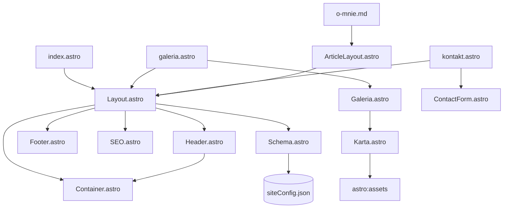

# AGENTS.md — Astro Photography Portfolio

> Quick-reference for AI agents. Structured for grep/ast scanning. No prose.

> **INSTRUKCJA DLA AGENTA**: Wyjaśniaj mi dokładnie na czym polegają zmiany zanim je będę akceptował — nie znam się na pisaniu kodu.

---

## 1. PROJECT_META

- **Stack**: Astro 7.x + Tailwind CSS v4 (Vite plugin) + TypeScript (strict)
- **Purpose**: Static photography portfolio (Home, Galeria, O mnie, Kontakt)
- **Output**: `dist/` (static) — `astro build` → deploy anywhere
- **Entry**: `src/pages/index.astro` (root), file-based routing
- **Config**: `astro.config.mjs` (site URL, sitemap, Tailwind)
- **Env**: `.env` → `PUBLIC_FORMSPREE_ID` (Formspree endpoint)

---

## 2. ARCHITECTURE

### File Tree (src/)

```
src/
├── layouts/
│   ├── Layout.astro         # Base HTML, <head>, Header, Footer, <slot>
│   └── ArticleLayout.astro  # Wraps Layout, adds <article class="prose">
├── pages/
│   ├── index.astro          # Home
│   ├── galeria.astro        # Gallery (loads images via glob, passes to Galeria)
│   ├── kontakt.astro        # Contact (uses ContactForm)
│   └── o-mnie.md            # Markdown + frontmatter → ArticleLayout
├── components/
│   ├── Header.astro         # Sticky nav, parallax, mobile hamburger, ARIA
│   ├── Footer.astro         # Copyright + social links
│   ├── SEO.astro            # Meta, OG, Twitter, canonical
│   ├── Schema.astro         # JSON-LD (Person, ProfessionalService, ImageGallery)
│   ├── Galeria.astro        # Masonry grid + IntersectionObserver fade-in + Lightbox
│   ├── ContactForm.astro    # Formspree AJAX, JS validation, honeypot
│   └── ui/
│       ├── Container.astro  # max-w-240 mx-auto px-4
│       └── Karta.astro      # Gallery card (button + Image + caption)
├── data/
│   └── siteConfig.json      # Person, Business, Gallery config for Schema/SEO
├── styles/
│   └── global.css           # @import tailwindcss; @theme (CSS vars)
└── env.d.ts                 # Astro types
```

### Module Graph (imports)

```
Layout.astro
  ├─ Header.astro
  ├─ Footer.astro
  ├─ SEO.astro
  ├─ Schema.astro
  └─ Container.astro

galeria.astro
  └─ Galeria.astro
       └─ Karta.astro

kontakt.astro
  └─ ContactForm.astro

o-mnie.md → ArticleLayout.astro → Layout.astro
```

### Data Flow

```
siteConfig.json → Schema.astro (Person, Business, ImageGallery)
                → SEO.astro (fallback title/desc)

galeria.astro: import.meta.glob() → zdjecia[] → Galeria.astro → Karta.astro
ContactForm: PUBLIC_FORMSPREE_ID → Formspree API
```

---

## 3. DEPENDENCY_GRAPH

### Import Graph (ASCII)

```
src/layouts/Layout.astro
├── ../components/Header.astro
├── ../components/Footer.astro
├── ../components/SEO.astro
├── ../components/Schema.astro
└── ../components/ui/Container.astro

src/components/Header.astro
└── ../components/ui/Container.astro

src/components/Schema.astro
└── ../data/siteConfig.json  (import json)

src/pages/index.astro
└── ../layouts/Layout.astro

src/pages/galeria.astro
├── ../layouts/Layout.astro
└── ../components/Galeria.astro
     └── ./ui/Karta.astro
          └── astro:assets (Image)

src/pages/kontakt.astro
├── ../layouts/Layout.astro
└── ../components/ContactForm.astro

src/pages/o-mnie.md
└── ../layouts/ArticleLayout.astro
     └── ./Layout.astro
```

### Mermaid



### External Dependencies

| Package | Purpose | Used In |
|---------|---------|---------|
| `astro` | Framework core | All `.astro` files |
| `@astrojs/sitemap` | `sitemap-index.xml` generation | `astro.config.mjs` |
| `@tailwindcss/vite` | Tailwind v4 Vite plugin | `astro.config.mjs` |
| `tailwindcss` | CSS framework | `global.css` |
| `@tailwindcss/typography` | `prose` class | `global.css`, `ArticleLayout.astro` |

### Data Dependencies

```
siteConfig.json
  ├─ person → Schema (Person), SEO (fallback)
  ├─ business → Schema (ProfessionalService)
  └─ gallery → Schema (ImageGallery)

PUBLIC_FORMSPREE_ID (.env)
  └─ ContactForm → Formspree API endpoint

images/
  ├─ DSC_*.jpg → Galeria (po)
  ├─ przed_DSC_*.jpg → Galeria (przed)
  └─ moje-zdjecie.jpg → Schema (Person.image), o-mnie.md
```

### Critical Path (build-time)

```
astro build
  ├─ import.meta.glob(images/) → Galeria data
  ├─ Schema.astro imports siteConfig.json
  ├─ SEO.astro uses Astro.site + Astro.url
  └─ Tailwind scans all .astro for classes → CSS
```

---

## 4. CONVENTIONS (hard rules)

### TypeScript
- `extends: "astro/tsconfigs/strict"` — no `any`, explicit return types on exported functions
- Props interfaces in same file (see `SEO.astro:5-12`, `Schema.astro:12-20`)
- `Astro.props` destructuring with defaults

### Imports
- Relative paths (`../components/...`) — no `@/` alias configured
- `astro:assets` for images (`import { Image } from 'astro:assets'`)
- JSON via `import siteConfig from "../data/siteConfig.json"` (type-safe via `env.d.ts`)

### Components
- `.astro` for everything (UI + logic + style + script)
- Frontmatter (`---`) for server logic, `<script>` for client logic
- `<style>` scoped by default (no CSS modules needed)
- Single default export (the component itself)

### Styling
- Tailwind v4 via `@import "tailwindcss"; @plugin "@tailwindcss/typography";`
- Design tokens in `@theme` block (`global.css:4-11`) — CSS variables only
- No inline styles except `style="transform: ..."` in client scripts
- `prose` class from `@tailwindcss/typography` for markdown content

### Accessibility (non-negotiable)
- ARIA labels on all interactive elements (Header, Lightbox, Form)
- `prefers-reduced-motion` respected (Header parallax, Galeria fade-in)
- `focus-visible` via Tailwind (`focus:border-accent focus:ring-2 focus:ring-accent`)
- Alt text fallback: `alt={opis || "Zdjęcie z portfolio fotograficznego Wiktora"}` (Karta.astro:18)
- Semantic HTML: `<nav>`, `<main>`, `<article>`, `<footer>`, `<button type="button">`

### Images
- `import.meta.glob(..., { eager: true })` for build-time asset loading
- `astro:assets` `<Image>` with `width`, `height`, `loading="lazy"`, `decoding="async"`
- Before/after pairing by filename convention: `DSC_*.jpg` + `przed_DSC_*.jpg`

### Scripts
- Inline `<script>` in same `.astro` file (no separate `.ts` files)
- Type assertions: `as HTMLImageElement`, `as HTMLFormElement`
- Event listeners with `{ passive: true }` where applicable
- Cleanup: `IntersectionObserver.unobserve()`, `removeEventListener` not needed (page unload)

---

## 5. MECHANISMS (reference)

### Header (Header.astro)
- **Sticky bar**: 60px (`h-15`), `overflow-hidden` on inner div only (allows mobile dropdown)
- **Parallax**: `scrollY * 0.25` capped at 10px, `requestAnimationFrame` throttled, shadow after 12px scroll
- **Mobile menu**: Hamburger button toggles `#menu-mobilne` (hidden md:hidden), ARIA expanded/controls
- **Close triggers**: link click, Escape key, resize > 48rem (md breakpoint)

### Galeria (Galeria.astro)
- **Layout**: CSS columns (`columns-2 md:columns-3 gap-6`) — masonry without JS
- **Fade-in**: `IntersectionObserver` (threshold 0.15, rootMargin -60px)
  - Row-based stagger: `getBoundingClientRect().top` grouped by 24px tolerance → `transitionDelay` 60ms/row max 360ms
  - Recalculated on `window.load` (images may shift layout)
- **Lightbox**: Single shared DOM (`#lightbox`), swaps `src` on click
  - Desktop: `mouseenter`/`mouseleave` → przed/po
  - Mobile: `touchstart` (preventDefault) / `touchend` / `touchcancel`
  - Close: backdrop click, Escape, close button

### ContactForm (ContactForm.astro)
- **Validation**: JS takes over (`form.noValidate = true`)
  - Per-field: `blur` = show errors, `input` = update existing errors only
  - Regex email: `/^[^\s@]+@[^\s@]+\.[^\s@]+$/`
  - Polish messages, `aria-live="polite"` on error spans
- **Submit**: `fetch` to Formspree (`Accept: application/json`)
  - Success: reset form, clear errors, green status
  - Error: parse Formspree `errors[]` or generic message
- **Honeypot**: `<input name="_gotcha" class="hidden" aria-hidden="true">`

### Schema (Schema.astro)
- Always outputs: `Person` + `ProfessionalService`
- Conditional: `ImageGallery` only if `zdjecia` prop passed (galeria.astro does)
- URLs absolutized via `new URL(..., Astro.site)`
- Injected as `<script type="application/ld+json" set:html={JSON.stringify(...)}>`

### SEO (SEO.astro)
- Canonical: `canonicalURL` prop or `new URL(Astro.url.pathname, Astro.site)`
- OG image: `image` prop or `/og-default.jpg` → absolutized
- Twitter: `summary_large_image`
- Locale: `pl_PL`

---

## 6. COMMON_TASKS (recipes)

### Add a new page
1. Create `src/pages/nazwa.astro` (or `.md` for content)
2. Import `Layout` (or `ArticleLayout` for articles)
3. Pass `title`, `description` to Layout
4. Add nav link in `src/data/nav.ts` (see Faza 1 plan)

### Add gallery image
1. Add `DSC_XXXX.jpg` + `przed_DSC_XXXX.jpg` to `images/`
2. Add entry to `opisy` object in `galeria.astro:10-20`
3. Build — `import.meta.glob` picks up automatically

### Modify Schema.org data
1. Edit `src/data/siteConfig.json` (Person, Business, Gallery)
2. For page-specific: pass `zdjecia` prop to `<Schema />` in Layout

### Change colors/design tokens
1. Edit `@theme` block in `src/styles/global.css:4-11`
2. Values: `--color-paper`, `--color-ink`, `--color-muted`, `--color-card`, `--color-accent`, `--color-line`

### Add form field
1. Add HTML in `ContactForm.astro` (label, input, error span, `aria-describedby`)
2. Add to `pola` object in script (`ContactForm.astro:103-116`)
3. Add validation in `walidujPole()` (`ContactForm.astro:121-140`)
4. Add event listeners in forEach (`ContactForm.astro:174-177`)

### Update nav links (active state)
1. Create `src/data/nav.ts` exporting `navLinks: {href, label}[]`
2. Import in `Header.astro`, compute `isActive = link.href === Astro.url.pathname`
3. Render `aria-current="page"` + style in `<style>` block

---

## 7. CONFIG_AND_COMMANDS

### package.json scripts
- `npm run dev` — `astro dev` (localhost:4321)
- `npm run build` — `astro build` → `dist/`
- `npm run preview` — `astro preview` (test build locally)
- `npm run astro` — Astro CLI

### Key config files
- `astro.config.mjs`: `site` (canonical domain), `sitemap()`, Tailwind Vite plugin
- `tsconfig.json`: extends `astro/tsconfigs/strict`
- `.env`: `PUBLIC_FORMSPREE_ID` (required for contact form)
- `.env.example`: template

### Build output
- Static files in `dist/`
- Images optimized by Astro Assets → `dist/_astro/`
- Sitemap at `dist/sitemap-index.xml`

---

## 8. EXTENSION_POINTS

### Add new schema type
- Extend `Schema.astro` with new JSON-LD object
- Pass required data via props from page

### Add new UI component
- Create in `src/components/ui/` (dumb) or `src/components/` (smart)
- Follow existing pattern: frontmatter + template + optional `<style>` + optional `<script>`

### Add new page type (e.g., blog)
- Create layout in `src/layouts/` (e.g., `BlogLayout.astro`)
- Add collection in `src/content/` (Astro Content Collections)
- Update `Schema.astro` for `BlogPosting` type

### Modify image processing
- `galeria.astro` glob patterns (`DSC_*.jpg`, `przed_DSC_*.jpg`)
- `Karta.astro` Image props (width, quality, formats)

---

## 9. GOTCHAS (non-obvious behaviors)

1. **Astro.url vs Astro.site**: `Astro.url` = current page URL (runtime), `Astro.site` = config.site (build-time). Schema/SEO use `Astro.site` for absolutizing.

2. **import.meta.glob eager**: Loads ALL matched images at build. Large galleries → memory. Current: 12 images OK.

3. **Script isolation**: `<script>` in `.astro` runs in browser only. Frontmatter variables NOT available — use `data-*` attributes (ContactForm: `data-formspree-id`).

4. **CSS columns + IntersectionObserver**: Row detection uses `getBoundingClientRect().top` which changes on scroll. Recalculated once on `load` event.

5. **Formspree ID**: Must be set in `.env` as `PUBLIC_FORMSPREE_ID` (only the ID, not full URL). Form falls back to native POST if JS fails.

6. **Tailwind v4**: Uses `@import "tailwindcss"` + `@theme` — no `tailwind.config.js`. Custom colors = CSS variables.

7. **Mobile hamburger**: `md:hidden` stays in class list permanently (CSS handles desktop hide). JS only toggles `hidden` class.

8. **Lightbox single instance**: Reuses DOM, swaps `src`. Not mounted per image — memory efficient.

9. **Polish locale**: Hardcoded in Schema (`pl_PL`), SEO (`pl_PL`), date format in `o-mnie.md` frontmatter (`DD-MM-YYYY`).

10. **No test framework**: Manual verification via `npm run dev` + `npm run preview`.